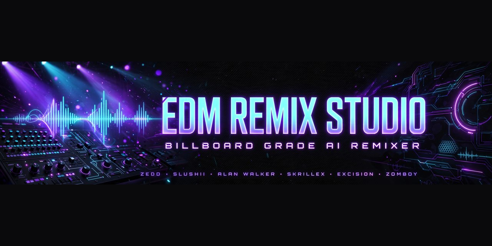
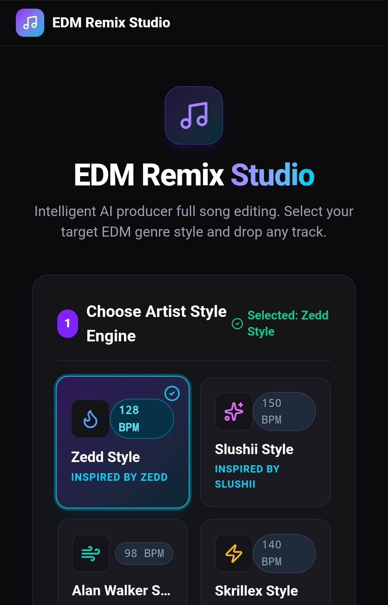
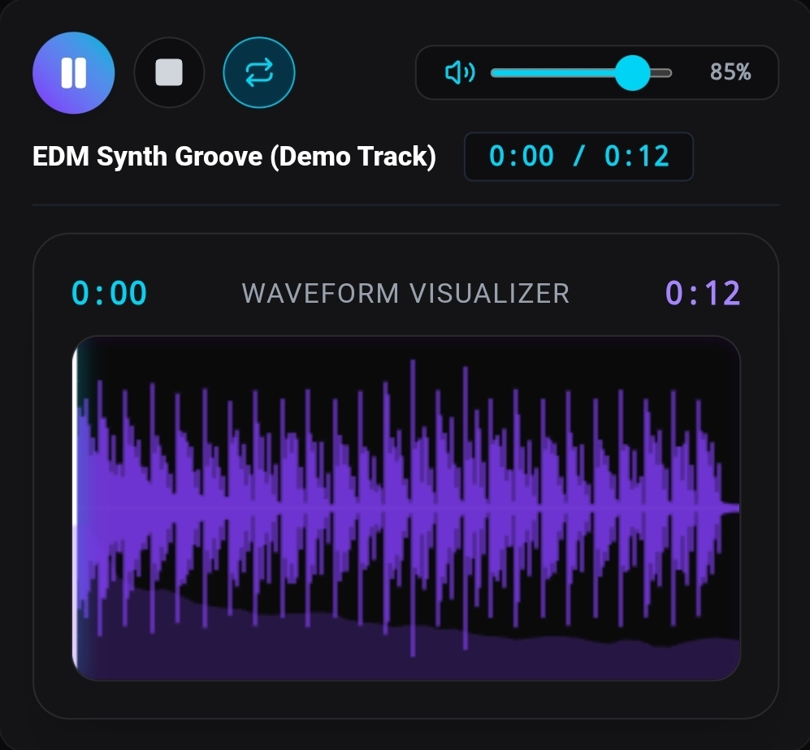
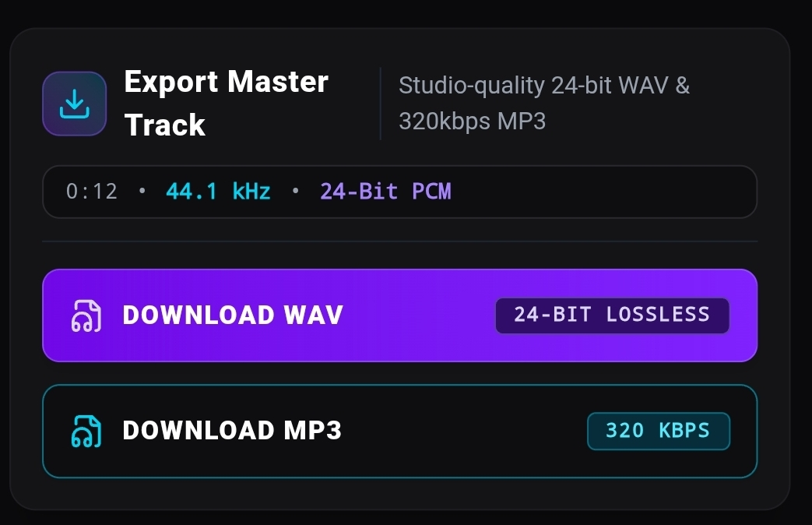

# 🎛️ EDM Remix Studio - Billboard Grade AI Remixer


> 🎛️ Billboard-Grade AI Remixer — Upload any song and transform it into Techno, House, Dubstep, Trance, DnB + 6 Artist DNA Engines (Zedd, Slushii, Alan Walker, Skrillex, Excision, Zomboy). Vocal Magic Studio, Slowed+Reverb / Nightcore Lab, 24-bit WAV/MP3 at -6 LUFS.

**🚀 Live Demo:** https://aistudio.google.com/apps/7d336009-dc81-47a0-ae87-61f778595edc

### 🔥 What it does

- **14 Engine Presets:** 8 Billboard EDM Genres (Techno 126, House 126, Dubstep 140, Chillstep 85, Trance 138, DnB 174, Future Bass 150, Lo-fi House 122) + 6 Artist DNA Engines

- **Vocal Magic Studio:** Pro Mode that deletes clashing vocals and rebuilds them as chopped Billboard hooks, auto-tune, speed/pitch/reverb fitting

- **Time & Space Lab:** 0.5x-2.0x speed, -12 to +12st pitch, slowed+reverb & nightcore presets - each genre auto-applies its signature

- **Billboard Structure:** Auto extends tracks to 3:15-3:45 with Intro/Build/Drop/Breakdown/Build2/Drop2/Outro

- **Export:** 24-bit WAV + 320kbps MP3 at -6 LUFS radio-ready loudness

### 🛠️ Built with

React + TypeScript + Web Audio API + Gemini 3.6 Flash

## 💿 Installation & Run

```bash
git clone https://github.com/MidnightMarie9/EDM-Remix-Studio.git
cd EDM-Remix-Studio
bun install
bun run dev
```

Then open `http://localhost:5173`

### 🔑 Env Setup

Create `.env` from `.env.example`:

```
VITE_GEMINI_API_KEY=your_key_here
```

### 🚀 How Billboard Mode Works

Each Artist Engine has its own vocalConfig:

- **Slushii:** 1.15x speed +3st bubbly
- **Alan Walker:** 0.9x speed cathedral reverb  
- **Excision:** 0.8x -4st brutal slowed
- **Zedd:** Clean future bass chops
- **Skrillex:** Aggressive vocal stutters
- **Zomboy:** Riddim growl pitching

All engines auto-tune vocals, match BPM/Key, and rebuild drops.

## 📸 Screenshots

### Main Studio


### Waveform Visualizer


### Export


---

Made with ❤️ by [MidnightMarie9](https://github.com/MidnightMarie9) - Billboard Ready
